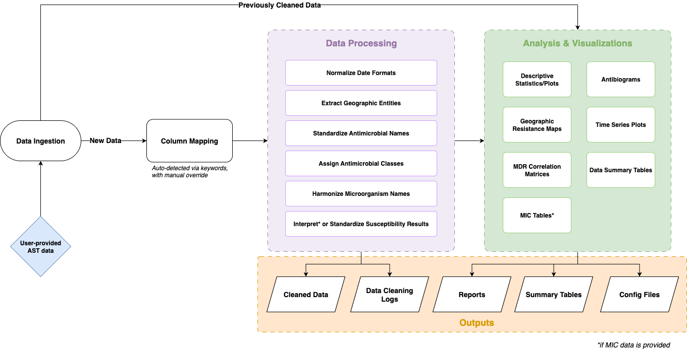
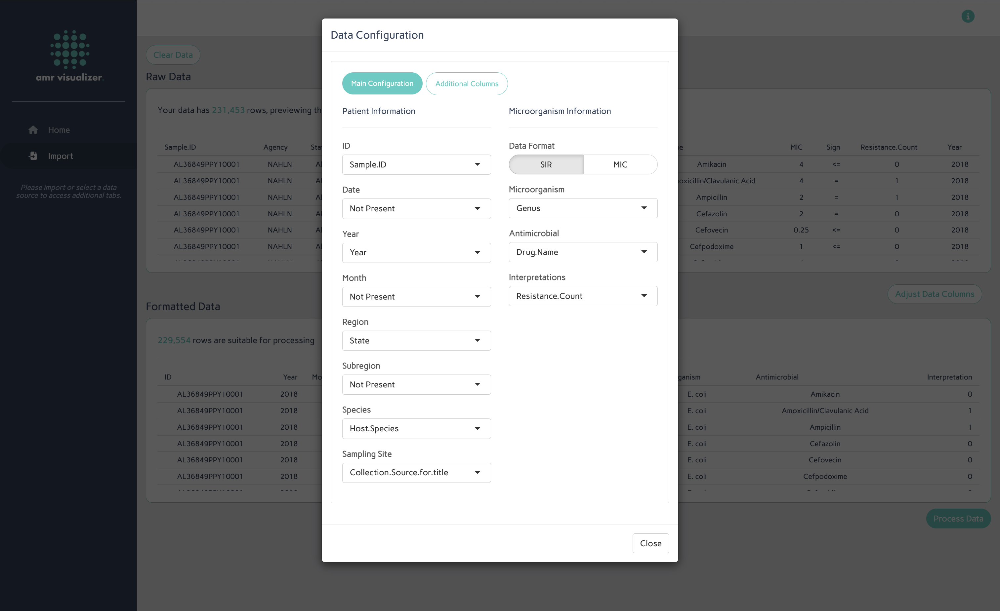
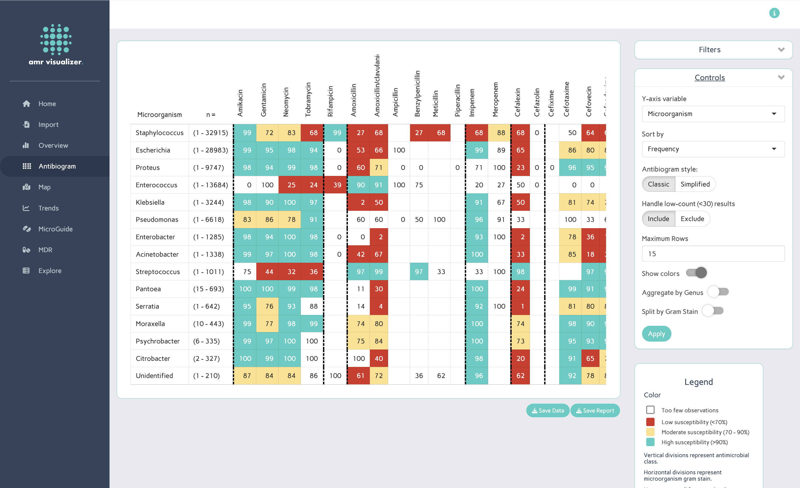

# AMR Visualizer: A Shiny App for the Rapid Analysis of Diagnostic Antimicrobial Susceptibility Test Data

**Kurtis E. Sobkowich**1, **Claudia Gisela Cobo Angel**\*,2,3, **Joshua Glass**\*,2, **Abdolreza Mosaddegh**\*,2,4, **Zvonimir Poljak**1, **Donald Szlosek**5, **J. Scott Weese**6,7, **Casey L. Cazer**2,8  

1 Department of Population Medicine, Ontario Veterinary College, University of Guelph  
2 Department of Clinical Sciences, College of Veterinary Medicine, Cornell University  
3 ICARS - International Centre for Antimicrobial Resistance Solutions  
4 Multidisciplinary Graduate Engineering Department, College of Engineering, Northeastern University  
5 IDEXX Laboratories Ltd.  
6 Department of Pathobiology, Ontario Veterinary College, University of Guelph  
7 Centre for Public Health and Zoonoses, Ontario Veterinary College, University of Guelph  
8 Department of Public and Ecosystem Health, College of Veterinary Medicine, Cornell University  

\*These authors contributed equally to this work.

# Summary

Antimicrobial resistance (AMR) is a critical global health threat that demands consistent, comparable, data-driven analysis. Yet, the complexity of working with AMR data, and the variability in analytical methods, often hampers comparison across studies and institutions. While open-source tools offer potential for standardization, they frequently require substantial statistical programming knowledge and impose rigid data formatting constraints, limiting their accessibility and adoption. These barriers contribute to fragmented surveillance and disconnected analytical efforts.

To address this challenge, we developed a standardized, user-friendly AMR analysis pipeline implemented as an interactive R Shiny dashboard. The tool enables users to import historical antimicrobial susceptibility testing (AST) data with minimal formatting and conduct robust analyses through an intuitive interface. By applying a consistent pipeline across datasets, it facilitates faster, more accessible analysis and improves comparability of resistance trends and patterns across institutions and studies.

# Statement of Need

AST data from diagnostic laboratories represent a valuable yet underutilized resource for epidemiologists, microbiologists, and clinicians in both human and veterinary medicine [@10.1093/ofid/ofw172.673]. This underuse limits the potential of AST data to inform empiric therapy and enhance AMR surveillance efforts [@doi:10.1128/jcm.00184-07]. Although not exclusive to AMR, microbiology laboratories often encounter significant barriers when implementing new technologies or modifying existing workflows. These include technology and personnel costs, limitations to staff expertise, privacy concerns, communication challenges, and the need for stakeholder buy-in [@10.1093/jac/dkae279]. By offering a tool that mitigates these barriers, it should be possible to unlock greater value from AST data that are already routinely collected but remain underexploited.  
  
Open-source code and packages for the rapid, standardized assessment of AMR data have been shown to reduce reporting time and improve result accuracy [@10.1093/jacamr/dlac143]. However, these tools require users to have at least a foundational knowledge of programming, which is not always held by those who manage AST data. There is a gap in tools that provide a graphical user interface (GUI) for non-programmers that also enable rapid and standardized exploratory data analysis, adhere to good practices in AMR data cleaning and interpretation, and remain open-source, and customizable for different contexts.

# Approach

The AMR Visualizer is designed with flexibility and accessibility in mind as it attempts to limit the amount of preprocessing required before data are uploaded. This "format-free upload" philosophy introduces several challenges that need to be overcome to accommodate the diverse formats of antimicrobial susceptibility testing (AST) data encountered across institutions. Data from different institutions are likely to differ in both format (e.g., column structure/layout) and content (e.g., naming conventions), both of which must be addressed.

## *Harmonized Formatting*

The application accepts data in both wide format (one row per sample with multiple test result columns) and long format (multiple rows per sample, each representing a single test). If data are provided in wide format, the app automatically reshapes them into long format using pattern recognition to enable standardized downstream analysis. To handle datasets with different column structures, the app uses keyword-based detection to identify common fields (e.g., date, organism, antimicrobial). Users can review and adjust these column mappings to correct any misclassifications. Additional preprocessing steps ensure consistency, for example, dates provided as separate day, month, and year columns are combined and converted into a standardized format. The aim is to ensure that, regardless of the original structure or layout, all uploaded data are standardized into a common format for analysis.

## *Harmonized Content*

The application uses existing ontologies and controlled vocabulary lookup tables from the `AMR` R package [@JSSv104i03] to standardize microorganism and antimicrobial agent names through rule-based fuzzy matching and reference taxonomies. This process accommodates common inconsistencies such as misspellings, abbreviations, and synonymous drug names (e.g., generic vs. trade names). Additional attributes, such as antimicrobial class, and microorganism gram-stain appearance are similarly inferred using information from the same package.

To support mapping functionality, users can provide region and subregion information, which the application processes using named entity recognition to match entries against locally stored geographic boundary files. Users may also choose to retain additional data columns for filtering or subgrouping purposes; however, these supplementary fields are not cleaned or standardized.

These harmonization steps allow heterogeneous datasets to be transformed into a consistent format, enabling comparable and reproducible analyses across sources.

## *Analysis*

By standardizing diverse data sources into a consistent structure and nomenclature, the AMR Visualizer enables uniform analytical workflows across varied datasets. This harmonization simplifies comparisons between laboratories by reconciling synonymous terms and formatting inconsistencies. In contexts where sharing raw data is limited by intellectual property concerns, patient confidentiality, or regulatory restrictions, the application offers an alternative: users can generate and share aggregated, anonymized summary tables that contain no patient-identifying information.

The application is developed in R, utilizing Shiny for the user interface, `dplyr` and `tidyr` for data transformation, and `ggplot2`, `DT`, `Leaflet`, and `Plotly` for data visualization.

## *Data Privacy*

In adherence to data privacy considerations, all processing occurs locally within the user's environment, and no uploaded data are stored externally. Users have the option to download the cleaned dataset for external use or future re-upload, in which case the data processing steps are skipped to improve efficiency.

# Usage

This tool is intended for professionals with access to clinical microbiology data and a working understanding of antimicrobial resistance. While no background in epidemiology, programming, or statistics is required, users should be aware of the limitations of diagnostic laboratory data and avoid overgeneralizing its applicability.  
  
Users can load data in three ways: by selecting from a set of publicly available files, uploading raw data in `.csv` or `.parquet` format, or uploading a previously cleaned file downloaded from the app. User-uploaded data are not stored after the app is closed, so users are encouraged to download their cleaned data following processing for later use.

When a new data file is uploaded, the app checks embedded metadata to determine whether it has already been cleaned. If the file has been previously processed, the cleaning step is skipped. Otherwise, the app guides the user through a series of data cleaning steps before analysis can proceed. User-uploaded data may include either pre-interpreted S/I/R (susceptible, intermediate, resistant) results or raw minimum inhibitory concentration (MIC) values. If MIC values are provided, users can select from a list of European Committee on Antimicrobial Susceptibility Testing (EUCAST) or Clinical and Laboratory Standards Institute (CLSI) breakpoint guidelines to interpret the data during processing. Once cleaned, files can be downloaded and reused to avoid reprocessing in the future. Multiple cleaned files can also be uploaded simultaneously and will be automatically merged—ideal for workflows involving routine updates (e.g., monthly data), as only the newest file requires cleaning before being appended to the existing dataset. For transparency, a log file is generated documenting any changes made to microorganism or antimicrobial columns. At this stage, users also have the option to manually adjust microorganism or antimicrobial names, if needed.

Following data processing, several analysis tabs become available to the user. Available tabs include:

-   **Overview** - Generate descriptive statistics and frequency plots to summarize the dataset.\

-   **MIC Tables** - Interpretation tables summarizing how MIC values were interpreted according to the selected breakpoints.\

-   **Antibiogram** - Rapidly construct customized antibiograms through a combination of data filters and controls.\

-   **Maps** - Visualize regional antimicrobial susceptibility through choropleth maps.\

-   **Trends** - Analyze temporal trends in antimicrobial susceptibility.\

-   **MDR** - Explore multidrug resistance (MDR) patterns using correlation matrices to identify relationships between resistance profiles.\

-   **Explore** - Generate customizable summary tables of susceptible, intermediate, and resistant isolates based on user-defined strata.

  Across all tabs, filters and controls are provided such that users can assess resistance in specific scenarios. Tables and figures are readily saved as images and `html` documents, with all applied filters recorded for transparency and reproduction.
  

# Acknowledgements

We gratefully acknowledge the contributions of numerous individuals whose support and input were instrumental in the development of this antimicrobial resistance (AMR) analysis application. We thank the domain experts, epidemiologists, microbiologists, and developers who provided valuable feedback and guidance throughout the design and testing phases.

In particular, we would like to acknowledge the following contributors:\
*Gayatri Anil, Wendy Anne Beauvais, Emma Bollig, Melissa Boyd, Stephen Cole, Anne Deckert, Jaclyn Dietrich, Amy Fridlund, Amelia Frye, Jennifer Granick, Cassandra Guarino, Carolyn (Lynn) Guptill‑Yoran, Kassie Marino, Uli Muellner, Maho Okumura, Poppy Pakinui, Santosh Kumar Satapathy, & Nick Snellgrove*

All listed contributors are acknowledged for their collaborative input, thoughtful discussions, and/or testing support and are listed in alphabetical order to reflect equal contributions.

# Availability and Community Guidelines

The AMR Visualizer is under active development, with continuous enhancements aimed at expanding its features and supporting analyses across diverse microbial species and geographic contexts. Users and contributors are encouraged to report bugs, suggest new features, or contribute code through the project's GitHub repository. This collaborative approach ensures the tool remains responsive to the evolving needs of the AMR research community.  

The application is accessible through the following channels:

-   **Docker Image:**\
    `ksobkowich/amrdata-visualizer`\
-   **Source Code:**\
    Available on [GitHub](https://github.com/ksobkowich/AMRDataVisualizer) under the MIT License.\
    **Run Locally:**\
    Clone the repository or launch directly in R using:\
    `shiny::runGitHub("ksobkowich/AMRDataVisualizer")`\
-   **Demonstration Video:**\
    A walkthrough is available on [YouTube](https://www.youtube.com/watch?v=QYW0U3wZqoQ&ab_channel=KurtisSobkowich).

The application comes pre-loaded with sample data to help users explore its features and functionality.

# References

